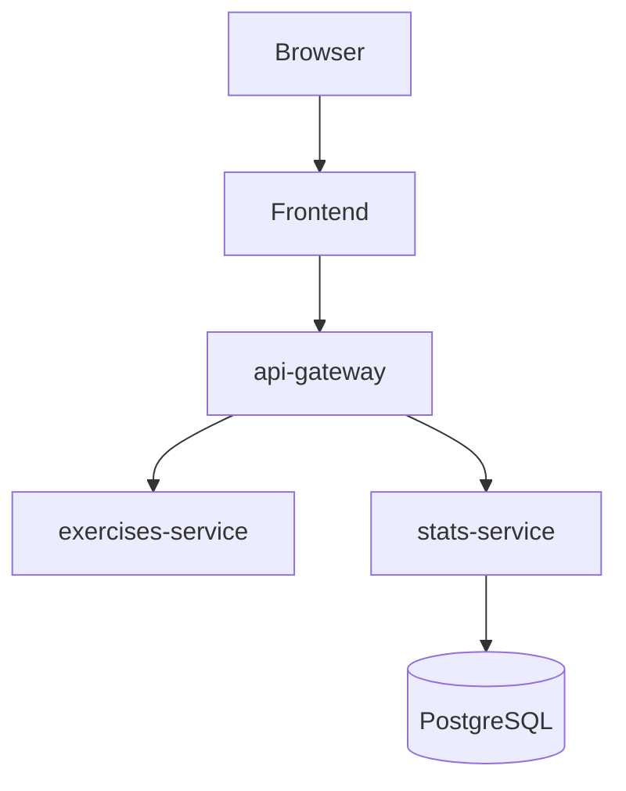

# PianOps

A small app for practicing note-reading on a musical staff. Built as a personal project during my DevOps training — the goal was to actually deploy something real on Azure, end to end, not just spin up resources and stop.

## Architecture



Three FastAPI services and a static frontend served by nginx, all running on AKS. Only `stats-service` talks to a database.

## Stack

- Python / FastAPI / SQLAlchemy
- Vanilla JS + [VexFlow](https://www.vexflow.com/) for rendering the staff
- Terraform for the Azure infra (AKS, ACR, Key Vault, PostgreSQL)
- GitHub Actions for CI/CD, authenticating to Azure via OIDC (no stored secrets)
- pre-commit + ruff for linting/formatting

## Structure

```
PianoOps/
├── apps/
│   ├── api-gateway/
│   ├── exercises-service/
│   └── stats-service/
├── frontend/
├── infra/          # Terraform
├── k8s/            # Kubernetes manifests
└── .github/workflows/
    ├── ci.yml       # lint + terraform validate
    └── deploy.yml   # deploy to AKS (manual trigger)
```

## Deployment

Deploys through the "Deploy to AKS" GitHub Actions workflow — triggered manually, not on every push, to keep cost under control on a personal Azure subscription. It applies Terraform, builds and pushes the images, then deploys to the cluster.

Public IPs change every time the cluster gets rebuilt, so the pipeline looks them up at deploy time instead of having them hardcoded anywhere.

## Running locally

Each service can be run on its own:

```bash
cd apps/<service>
pip install -r requirements.txt
uvicorn main:app --reload --port 8000
```

A `docker-compose.yml` to run everything together is still on the list.
